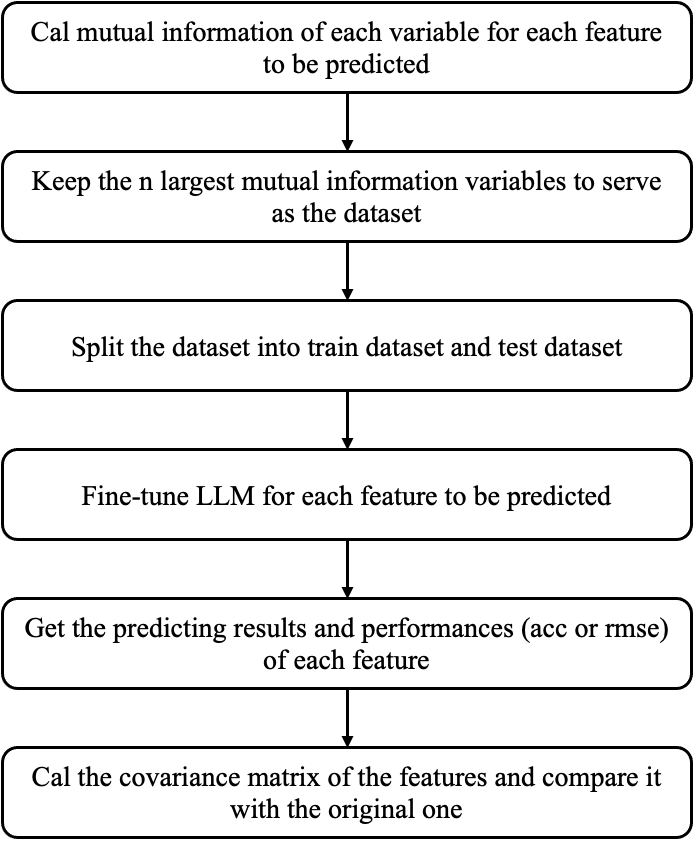
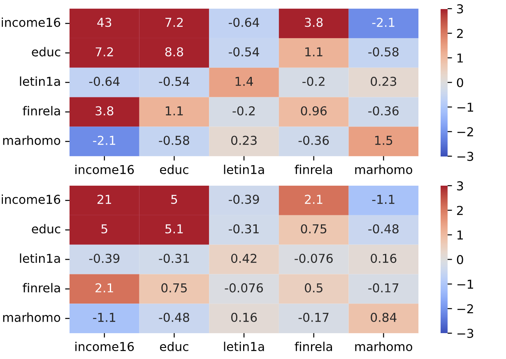

## LLM Imputation
This project aims to utilize LLMs to impute missing values in a specific survey dataset. Currently, Llama2-13b, developed by Facebook, is employed for this task. We select five features from the GSS2022 data to fine-tune Llama2 and assess the performance of the fine-tuned models.

### Related Literature
#### Sociological Strategies
Missing values are prevalent in social survey datasets and are categorized into three types based on their correlation with the variables of interest: missing completely at random (MCAR), missing at random given a set of control variables (MAR), and neither MCAR nor MAR but systematic (NI) ([Lin & Tsai, 2020](https://link.springer.com/article/10.1007/s10462-019-09709-4)). Among these, MAR is the most common.
Traditional techniques for handling missing values can generally be categorized into two main types: deletion and substitution. Case deletion involves directly dropping items with missing values, and it is unbiased only when MCAR is met. Pairwise deletion utilizes respondents who answered a pair of variables to estimate covariance. Both deletion strategies result in a smaller sample size and reduced level of significance. Substitution methods include mean substitution using either the entire sample or within subgroups, adjustment with indicator variables, or regression models. However, substitution often leads to reduced uncertainty and variance.
[Multiple imputation](https://www.jstor.org/stable/2291635) represents a more recent strategy for predicting missing values. It facilitates the pooling of parameter estimates to derive an enhanced parameter estimate.

#### Engineering imputation strategies
Some missing values imputation strategies in engineering may offer valuable references. Here's a concise overview of several key models.
**Neighbor-based imputation**:
- kNN: find the nearest neighbors with the smallest distance
- kNNE: retrieve more neighbors over subsets and combine results
- MIBOS: distance is defined as the number of consistent features
- (the key problem of neighbor-based imputation is that the similarity functions are not always effective)

**Clustering-based imputation**
- fuzzy k-means: clustering based on the closest centroid
- GMM: data is generated from a mixture of Gaussian distributions
- CMI: measures the amount of information that two random variables share about a third random variable

**Statistical models**
- ERACER: learn from the correlated values of different features
- DLM: consider the likelihood on distances
- **[HoloClean](https://arxiv.org/abs/1702.00820)**: performs statistical inference on the factor graph using the attention mechanism

**Generative models**:
- [MIDAS](https://arxiv.org/abs/1705.02737): employs a class of denoising autoencoders to perform multiple imputation
- [MIWAE](https://arxiv.org/abs/1812.02633): utilizes importance-weighted autoencoders to learn the latent distribution of data
- [HI-VAE](https://arxiv.org/abs/1807.03653): uses variational autoencoders to capture the latent structure of the data
- [DataWig](https://jmlr.org/papers/v20/18-753.html): deep learning based feature extractors and automatic hyperparameter tuning

**Pre-trained models**:
- [IPM](https://ieeexplore.ieee.org/document/9458712): BERT-based semantic imputation model 

#### Evaluation Strategy
1. compare the estimation with the original datasets
2. calculate the distance from the original datasets

### Work Flow

### File Structure
- configs
- |--task_description.json: define the type of the prediction task for each feature
- dataset
- logs
- results
- train_para: where to save the hyperparameters
- utils
- |--utils.py
- dataset_preparation.py: calculate the mutual information and generate the dataset (in label text or numbers)
- model.py: fine-tune and evaluate
- run.py: entry point

### Performance
|feature|label|rmse|range|
|---|---|---|---|
|income16|total family income|5.0528|[1, 26]|
|educ|highest year of school completed|1.9605|[1,20]|
|letin1a|number of immigrants nowadays should be|1.0497|[1,5]|
|finrela|opinion of family income|0.7122|[1,5]|
|marhomo|homosexuals should have right to marry|0.9068|[1,5]|

### To-Dos
- [ ] Different LLMs
- [ ] Does more features help?
- [x] Can the imputed data keep the covariance?
- [ ] Other feature selection strategies
- [ ] Does the pre-trained data has an influence on the resulted covariance?
- [ ] Text-based imputation
- [ ] Predict n features in one run?
