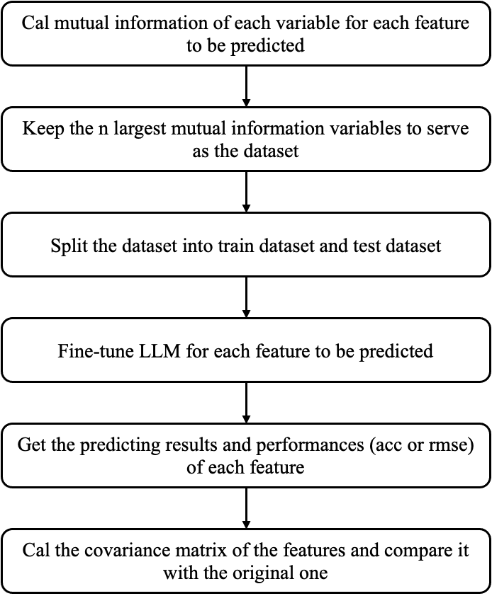

## LLM Imputation
This project aims to use LLMs to impute the missing values in a particular suvey dataset. Currently, Llama2-13b developed by Facebook is used to conduct this task. We select 5 features from GSS2022 data to fine-tune Llama2 and also test the performance of the fine-tuned models.

### Related Literature
#### Sociological Strategies
Missing values are common in social survey datasets. They are categorized into three types according to there correlation with the variables in interest, namely missing completely at random (MCAR), missing at random given a set of control variables (MAR), and neither MCAR nor MAR but systematic (NI), among which MAR is the most common one.
Traditional techniques to handle missing values can be generally summarized as two main types, deletion and substitution. Case deletion means dropping items with missing values directly, and it is only unbiased when MCAR is met. Pairwise deletion use those who answered a pair of variables to estimate the covariance. Both deletion strategies lead to smalled sample size and reduced level of significance. Substitution methods involve mean substitution with the whole sample or within the subgroups, indicator variable adjustment or regression models. But substitution often results in reduced uncertainty and reduced variance.
Multiple imputation is a more recent missing values prediction strategy. It allows pooling of the parameter estimates to obtain an improved parameter estimate.

#### Engineering imputation strategies
Some missing values imputation strategy in engineering may also provide some important references. Here's a brief summary of important models.
**Neighbor-based imputation**:
- kNN: find the nearest neighbors with the smallest distance
- kNNE: retrieve more neighbors over subsets and combine results
- MIBOS: distance is defined as the number of consistent features
- (the key problem of neighbor-based imputation is that the similarity functions are not always effective)

**Clustering-based imputation**
- fuzzy k-means: clustering based on the closest centroid
- GMM: data is generated from a mixture of Gaussian distributions
- CMI: measures the amount of information that two random variables share about a third random variable

**Statistical models**
- ERACER: learn from the correlated values of different features
- DLM: consider the likelihood on distances
- **HoloClean**: performs statistical inference on the factor graph using the attention mechanism

**Generative models**:
- MIDAS: employs a class of denoising autoencoders to perform multiple imputation
- MIWAE: utilizes importance-weighted autoencoders to learn the latent distribution of data
- HI-VAE: uses variational autoencoders to capture the latent structure of the data
- DataWig: deep learning based feature extractors and automatic hyperparameter tuning

**Pre-trained models**:
- IPM: BERT-based semantic imputation model 

#### Evaluation Strategy
1. compare the estimation with the original datasets
2. calculate the distance from the original datasets

### Work Flow

### File Structure
- configs
|--task_description.json: define the type of the prediction task for each feature
- dataset
- logs
- results
- train_para: where to save the hyperparameters
- utils
|--utils.py
- dataset_preparation.py: calculate the mutual information and generate the dataset (in label text or numbers)
- model.py: fine-tune and evaluate
- run.py: entry point

### Performance

### To-Dos
[ ] Different LLMs
[ ] Does more features help?
[x] Can the imputed data keep the covariance?
[ ] Other feature selection strategies
[ ] Does the pre-trained data has an influence on the resulted covariance?
[ ] Text-based imputation
[ ] Predict n features in one run?
